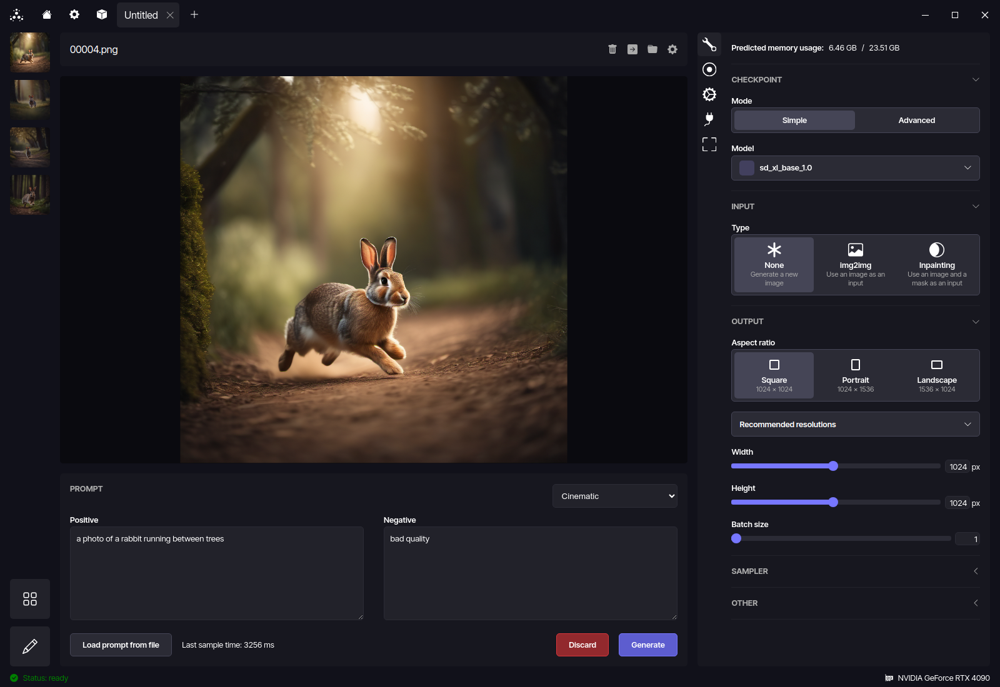

<h1>
<p align="center">
<a href="https://metastable.studio">
<picture>
<source media="(prefers-color-scheme: dark)" srcset="./assets/logo_dark_mode.svg">

</picture>
</a>
</p>
</h1>

> [!WARNING]  
> This project is still in an experimental state. Breaking changes WILL occur and may require manual intervention or reinstallation of the software.

> [!NOTE]  
> [Download Metastable for Windows, macOS and Linux.](https://metastable.studio/download)

> [!NOTE]  
> [Join the project's Discord server for updates, suggestions and development.](https://discord.gg/Sf9zKaXzXe)

<p align="center">

</p>

A project-based Stable Diffusion Web UI, for easier organization of generated images. **Work in progress.**

The backend is based on [ComfyUI's backend](https://github.com/comfyanonymous/ComfyUI).

## Credits

Metastable uses code from:

- [comfyanonymous/ComfyUI](https://github.com/comfyanonymous/ComfyUI)
- [kohya-ss/sd-scripts](https://github.com/kohya-ss/sd-scripts)

## Automatic installation

Download an installer from: https://metastable.studio/download

Builds are available for:

- Windows (64-bit only; installer)
- macOS (64-bit and Apple Silicon; dmg)
- Linux (64-bit only; AppImage)

## Manual installation

### Docker

If you have an NVIDIA GPU and nvidia-container-runtime is properly configured in your system, you can use the easy Docker compose setup:

```
docker compose up
```

The UI will be accessible at https://localhost:5001/

### Requirements

- node.js 20+
- npm
- yarn (`npm install -g yarn` or via your system's package manager)
- git

#### Alpine Linux

- `apk add git nodejs npm`
- `npm install -g yarn`

#### Arch Linux

- `pacman -S git node npm`
- `npm install -g yarn`

#### CentOS/RHEL/Fedora

- `dnf install git nodejs npm`
- `npm install -g yarn`

#### Debian/Ubuntu

- `apt install git nodejs npm`
- `npm install -g yarn`

#### openSUSE

- `zypper install git nodejs20`
- `npm install -g yarn`

#### Windows

- Install node.js 20 or newer: https://nodejs.org/en/download
- Install git: https://git-scm.com/download/win
- Open Command Prompt (or Powershell)
- Run `npm install -g yarn`

### Installation

- Open Terminal/Command Prompt/Powershell
- `git clone https://github.com/mat-sz/metastable.git`
- `cd metastable`
- `yarn install`
- `yarn build`
- `yarn start`
- Follow the on-screen instructions.

## Usage

Run:

```
yarn start
```

The web app will be available at: http://127.0.0.1:5001/
